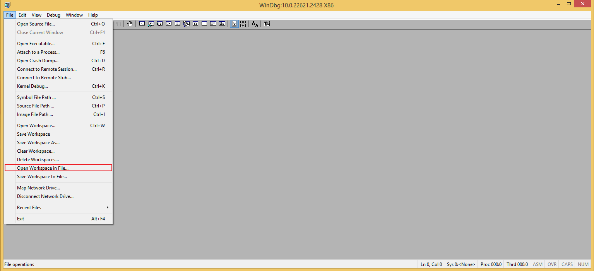
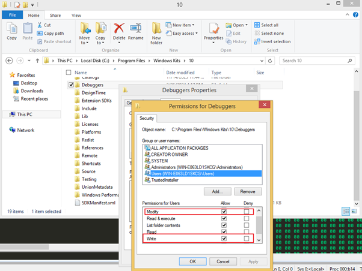

# OSED
## Narly
* Put narly.dll in C:\Program Files\Windows Kits\10\Debuggers\x86\winext\


## WinDBG GUI
* Load Workspace from File



## ROP++
* Run rp-win.exe
```
rp-win.exe --file narly.dll -r 5 --bad-bytes 00,01 > rop.txt
```


## Mona
1. Install python-2.7.17.msi
2. Install vcredist_x86.exe
3. Put pykd.pyd in C:\Program Files\Windows Kits\10\Debuggers\x86\winext\
4. Put windbglib.py in C:\Program Files\Windows Kits\10\Debuggers\x86\
5. Put mona.py in C:\Program Files\Windows Kits\10\Debuggers\x86\
6. Open cmd.exe with Administrator Privilege
```
cd "C:\Program Files\Common Files\Microsoft Shared\VC\"
regsvr32 /s msdia90.dll
```
7. Set Folder Permission


8. Start Mona
```
.load pykd.pyd
!py mona
!py mona.py rop -m *.dll -cp nonull
!py mona.py rop -m *.dll -cp -cpb '\x00\x3b'
```


## filter-ropfile.py
Can used for refrence, but the ROP-q1 and ROP-q2 are not full list
```
python3 filter-ropfile.py rop.txt                                              
```


## Code-caver.py
Can used for finding code cave (a RX location of bunch of 0s)
From noptech Github repository (https://raw.githubusercontent.com/nop-tech/code_caver/main/code_caver.py)
```
0:000> !py code_caver.py 55100000 55107000 
Code Caver
[*] Scanning for code caves in the address range 0x55100000 to 0x55107000

[!] Code cave found at address 55102d3a with a size of 704 bytes

[*] DONE
```
